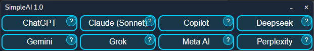

# SimpleAI



> A lightweight desktop launcher for multiple AI chatbot services in dedicated windows

SimpleAI is a cross-platform desktop application built with [Wails](https://wails.io) that provides quick access to popular AI chatbot services in standalone windows. Say goodbye to browser tabs cluttering your workflow!

## ✨ Features

- 🚀 **Multi-Service Launcher** - Access 8 major AI services from one place:
  - ChatGPT (OpenAI)
  - Claude (Anthropic Sonnet)
  - Copilot (Microsoft)
  - Deepseek
  - Gemini (Google)
  - Grok (X)
  - Meta AI (Facebook)
  - Perplexity

- 💾 **Window Position Memory** - Remembers window positions and sizes across sessions
  - Universal `modWindowMemory` module with platform-specific implementations
  - Windows: Automatic titlebar offset compensation
  - Linux: xdotool fallback for GTK compatibility
  - macOS: Native coordinate system support
- 🎨 **Modern UI** - Futuristic launcher design with smooth hover effects
- 🪟 **Multi-Instance Support** - Open multiple AI services simultaneously in separate windows
- 🖥️ **Cross-Platform** - Runs on Windows, macOS, and Linux
- ⚡ **Native Performance** - Built with Go and WebView2 for fast, lightweight operation
- 🤖 **Automated Builds** - Prerelease binaries for Windows and Linux on every commit

## 📦 Installation

### Download Pre-built Binaries

Download the latest release for your platform from the [Releases](../../releases) page.

### Build from Source

**Prerequisites:**

- Go 1.23 or later
- Node.js 18+ and npm
- Wails CLI: `go install github.com/wailsapp/wails/v2/cmd/wails@latest`

**Clone and build:**

```bash
git clone https://github.com/chrilep/SimpleAI.git
cd SimpleAI
wails build
```

The compiled binary will be in `build/bin/`.

## 🚀 Usage

1. **Launch SimpleAI** - The main launcher window displays all available AI services
2. **Click a service button** - Opens that AI service in a new dedicated window
3. **Browse normally** - Navigate the AI service as you would in a browser
4. **Close and reopen** - Your window positions are automatically saved

### Service Information

Click the **?** icon on any service button to view details about that AI service.

## 🛠️ Development

### Live Development Mode

Run the app in development mode with hot reload:

```powershell
# Windows (PowerShell)
.\dev.ps1

# macOS/Linux
./dev.ps1
```

This starts the Wails dev server with:

- Frontend hot reload at `http://localhost:34115`
- Go backend with automatic restart
- Version injection from `wails.json`

### Project Structure

```
SimpleAI/
├── app.go                 # Backend logic & Go methods
├── main.go                # Application entry point
├── modWindowMemory/       # Reusable window position module
│   ├── README.md          # Module documentation
│   ├── windowposition.go  # Platform-independent logic
│   ├── windowposition_windows.go
│   ├── windowposition_linux.go
│   └── windowposition_darwin.go
├── frontend/
│   ├── src/
│   │   ├── main.js        # Frontend logic & UI
│   │   ├── app.css        # Component styles
│   │   └── style.css      # Global styles
│   └── wailsjs/           # Auto-generated Go bindings
├── build/                 # Build outputs
├── automated-prereleases/ # Automated prerelease builds
└── .github/workflows/     # CI/CD workflows
```

└── wails.json # Wails configuration

````

### Configuration

Edit `wails.json` to modify app metadata, version, or build settings. See [Wails Project Config](https://wails.io/docs/reference/project-config) for details.

## 📦 Building

The project includes build scripts that automatically inject version numbers:

### Windows

```powershell
.\build.ps1  # Builds for Windows (amd64)
````

### Cross-Platform Builds

**Prerequisites:** Install cross-compilation toolchains

- **Windows from Linux/macOS:** MinGW-w64 toolchain
- **Linux from Windows/macOS:** GCC cross-compiler
- **macOS:** Xcode Command Line Tools

Check your setup:

```bash
wails doctor
```

**Build commands:**

```bash
# Windows 64-bit
wails build -platform windows/amd64

# Linux 64-bit
wails build -platform linux/amd64

# macOS ARM64 (Apple Silicon)
wails build -platform darwin/arm64

# macOS Intel 64-bit
wails build -platform darwin/amd64
```

## 🗂️ Data Storage

SimpleAI stores configuration data in your system's standard config directory:

- **Windows:** `%APPDATA%\SimpleAI\`
- **macOS:** `~/Library/Application Support/SimpleAI/`
- **Linux:** `~/.config/SimpleAI/`

Stored files:

- `windows.json` - Window positions and sizes

### Linux Requirements

For window position tracking on Linux, install xdotool:

**Debian/Ubuntu:**

```bash
sudo apt-get install xdotool
```

**openSUSE/SUSE:**

```bash
sudo zypper install xdotool
```

**Fedora/RHEL:**

```bash
sudo dnf install xdotool
```

**Arch Linux:**

```bash
sudo pacman -S xdotool
```

This is required because GTK window APIs don't reliably report window positions. Without xdotool, windows will open at default positions on startup.

## 🧩 Technology Stack

- **Backend:** Go 1.23 + Wails v2.10.2
- **Frontend:** Vanilla JavaScript + Vite 3.x
- **Rendering:** WebView2 (Windows), WebKit (macOS/Linux)
- **UI:** CSS with custom styling, no frameworks

## 📄 License

This project is licensed under the **GNU Affero General Public License v3.0 (AGPL-3.0)**.

See [LICENSE](LICENSE) for the full license text.

## 🤝 Contributing

Contributions are welcome! Feel free to:

- Report bugs by opening an [issue](../../issues)
- Suggest new features or improvements
- Submit pull requests

## ⚠️ Disclaimer

SimpleAI is an independent launcher application and is not affiliated with, endorsed by, or sponsored by OpenAI, Anthropic, Microsoft, Google, X, Meta, or any other AI service provider. All trademarks belong to their respective owners.

## 👤 Author

**Christian Lepthien**

- Email: christian@lepthien.info
- GitHub: [@chrilep](https://github.com/chrilep)

---

Made with ❤️ using [Wails](https://wails.io)
